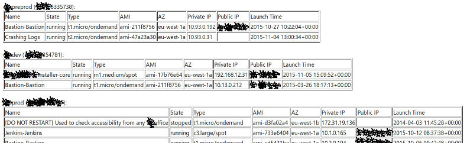

## Purpose

Report utilized AWS resources (for now only EC2 instances are supported) for multiple accounts. 

It helps to prevent running some instances unattended.

## Demo

How html report looks like
 

## Setup and run

1. Check that you have setup for aws-cli (~/.aws/config and ~/.aws/credentials files)
2. Install requeired python modules 

    ```
    $ /bin/bash installPythonModules.sh
    ```
3. Make skew-config with all accounts

    ```
      ---
        accounts:
          "aws account number":
            profile: profile-name-in ~/.aws/config
          "aws account number2":
            profile: profile-name-in ~/.aws/config
          "aws account number3":
            profile: profile-name-in ~/.aws/config
    ```
4. Export SKEW_CONFIG variable

    ```
    $export SKEW_CONFIG=skew-config
    ```
5. Launch report script with optional AWS region.

    ```
    ./reportUsage.py
    or 
    ./reportUsage.py eu-west-1
    ```
report.txt, report.html and report.yaml files will be generated.
6. Setup delivery of the report if necessary.
   You may use script reportDeliverySMTP.py as a starting point.
 
## TODO

+ volumes and EBS snapshots
+ apply best practices for Python world (tests, requerements.txt, etc)


#### References

1. [Skew - library for enumerate resources across AWS accounts] (https://github.com/scopely-devops/skew)
2. [Amazon regions for EC2 service] (http://docs.aws.amazon.com/general/latest/gr/rande.html#ec2_region)

